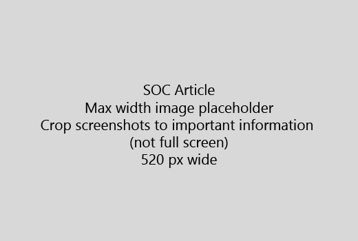

Avviare l'articolo con un'introduzione molto breve (1 frase). Imposto familiarità del lettore - perché si tratta di seguito. Cosa è necessario fare?Start your article with a very short introduction (1 sentence). Put yourself in the reader's place - why are they here? What should they do? 
  
1. È possibile ottenere retta a un elenco rapido dei passaggi per eseguire l'attività.Get straight to a quick list of steps to accomplish the task.
    
    Se è necessario descrivere il concetto o sarà più possibile passaggi prerequisiti, aggiungere un breve riepilogo sotto il passaggio di cui hanno bisogno e [collegamento](https://support.office.com/article/f37e7984-cf03-4fde-92d3-82970d7e241b.aspx) al concetto o passaggi.If you need to explain a concept, or they have to do pre-requisite steps, add a quick summary below the step where they need it, and [link](https://support.office.com/article/f37e7984-cf03-4fde-92d3-82970d7e241b.aspx) to the concept or steps. 
    
2. Mantenere procedure breve - passaggi preferibilmente 5 o meno, non più di 8.Keep procedures short - preferably 5 or fewer steps, no more than 8.
    
3. Utilizzare **lo stile dell'interfaccia utente** per gli elementi dell'interfaccia utente o per il testo devono immettere persone.Use **Ui style** for user interface elements or for text people need to enter. 
    
4. Utilizzare i verbi scegliere selezionano, o immettere come azioni e formattare il menu come **Menu** \> **comando**.Use the verbs choose, select, or enter as actions, and format menus as **Menu** \> **Command**.
    
5. Facoltativamente, aggiungere una schermata di contesto (se è difficile individuare l'interfaccia utente o è necessario per completare l'attività).Optionally, add a screenshot for context (if UI is hard to locate, or it's needed to complete the task).
    
    Larghezza massima: 520 pixel. Utilizzo di un tema standard, non visualizzare le informazioni personali e ritagliare in modo da visualizzare solo che cos'è pertinente.Maximum width: 520 pixels. Use a standard theme, do not show any personal information, and crop to show only what's relevant. 
    
    
  
Se si desidera aggiungere un video o cattura di schermata, utilizzare una griglia due colonne e verificare i passaggi descritti in sinistra e il video o cattura di schermata del diritto - vedere [passaggi ed esempio griglia video](https://support.office.com/article/14ce8e82-efa0-47f5-bb84-94f078db3dae.aspx).If you want to add a video or screenshot, use a two-column grid and have the steps in the left and the video or screenshot in the right - see [Steps and video grid example](https://support.office.com/article/14ce8e82-efa0-47f5-bb84-94f078db3dae.aspx). 
  
Destinazione non più di 500 parole per un articolo.Target no more than 500 words for an article.
  
# Articolo di esempioExample article

[Modificare la mia fotoChange my photo](https://support.office.com/article/555376e0-1fca-49ba-8434-307a0525c767.aspx)
  

