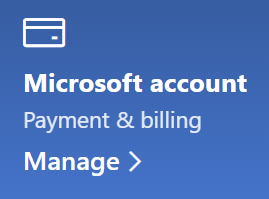

# Modificare le informazioni dell'account Microsoft

Passare a [https://account.microsoft.com](https://account.microsoft.com/) e accedere, se necessario. Verrà visualizzato il dashboard dell'account.  

**Modificare il nome e le informazioni personali**

1. Nella dashboard dell'account, accanto all'immagine e al nome dell'account, fare clic sui tre puntini (Altre azioni) > Modifica profilo**.
2. Nella pagina **Modifica profilo** usare i collegamenti disponibili per cambiare l'immagine del profilo, il nome, la data di nascita, il luogo e la preferenza relativa alla lingua di visualizzazione. Notare i collegamenti ai profili degli account Xbox o Skype, in cui è possibile modificare i dettagli specifici di tali account.

**Gestire indirizzi di posta elettronica e numeri di telefono**

A un account Microsoft sono associati uno o più indirizzi di posta elettronica o numeri di telefono come "alias". Per gestirli:

1. Nella dashboard dell'account, accanto all'immagine e al nome dell'account, fare clic sui tre puntini (Altre azioni) > **Modifica profilo**.
2. Nella pagina **Modifica profilo** fare clic su **Gestisci il modo in accedi a Microsoft**. 
3. Verrà visualizzato un elenco di alias dell'account e si può gestire l'elenco, incluse l'aggiunta e l'eliminazione di indirizzi di posta elettronica e numeri di telefono. Qui è anche possibile scegliere quali alias usare per accedere all'account e quale alias è considerato "principale" e verrà visualizzato nei dispositivi Windows 10.

**Gestire i metodi di pagamento, oltre che il nome e l'indirizzo per la fatturazione** 

1. Nella dashboard dell'account, accanto all'immagine e al nome dell'account, fare clic sui tre puntini (Altre azioni) > **Modifica profilo**.
2. In **Pagamento e fatturazione** fare clic su **Gestisci**.

    

3. Qui è possibile aggiungere, modificare e rimuovere modalità di pagamento e gli indirizzi di fatturazione associati. 
