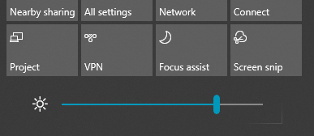

# Modificare la luminosità dello schermo in Windows 10Change screen brightness in Windows 10

Se si ha una versione di Windows 10 più recente della 1903, è disponibile un **dispositivo di scorrimento Luminosità** nel centro notifiche.If your Windows 10 is newer than version 1903, it has a **Brightness slider** in the action center. Per aprire il centro notifiche, fare clic sul pulsante **Notifica** nel lato destro della barra delle applicazioni o premere **Windows Home + A** sulla tastiera.To open the action center, click the **Notification** button at the rightmost side of your taskbar, or press **Windows home + A** on your keyboard.

Se si ha una versione precedente di Windows 10, il dispositivo di scorrimento Luminosità è disponibile passando a **[Impostazioni > Sistema > Schermo](ms-settings:display?activationSource=GetHelp)**.If your Windows 10 is an earlier version, you can find the brightness slider by going to **[Settings > System > Display](ms-settings:display?activationSource=GetHelp)**.

**Note**:**Notes**:

- Il dispositivo di scorrimento Modifica luminosità per lo schermo incorporato sui PC desktop che hanno un monitor esterno potrebbe non essere visibile.You might not see the Change brightness for the built-in display slider on desktop PCs that have an external monitor. Per modificare la luminosità di un monitor esterno, usare i controlli sul monitor.To change the brightness of an external monitor, use the controls on the monitor.
- Se non si ha un PC desktop e il dispositivo di scorrimento non viene visualizzato o non funziona, provare ad aggiornare il driver video.If you don't have a desktop PC and the slider doesn't appear or work, try updating the display driver. Nella casella di ricerca della barra delle applicazioni digitare **Gestione dispositivi**, quindi selezionare **Gestione dispositivi** nell'elenco dei risultati.In the search box on the taskbar, type **Device Manager**, and then select **Device Manager** from the list of results. In **Gestione dispositivi** selezionare **Schede video**, quindi selezionare la scheda video.In **Device Manager**, select **Display adapters**, then select the display adapter. Premere e tenere premuto (o fare clic con il pulsante destro) il nome della scheda video e fare clic su **Aggiorna driver**, quindi seguire le istruzioni.Press and hold (or right-click) the display adapter name and click **Update driver**; then follow the instructions.
