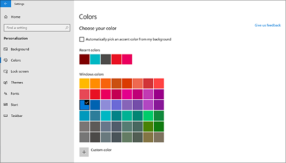
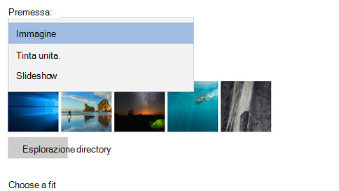

# Modificare lo sfondo e i colori del desktop

Per modificare l'impostazione dei colori, andare a **Start** Impostazioni Personalization Colors e quindi scegliere un colore personalizzato o Windows un colore principale  >    >    >  dallo sfondo.

Per modificare lo sfondo del desktop, passare a **Start** Impostazioni Sfondo personalizzazione e quindi scegliere un'immagine, un colore a tinta unita o creare  >    >    >  una presentazione di immagini. 

Vuoi altri sfondi e colori del desktop? Visita [Microsoft Store](https://www.microsoft.com/store/collections/windowsthemes) per scegliere tra decine di temi gratuiti.
