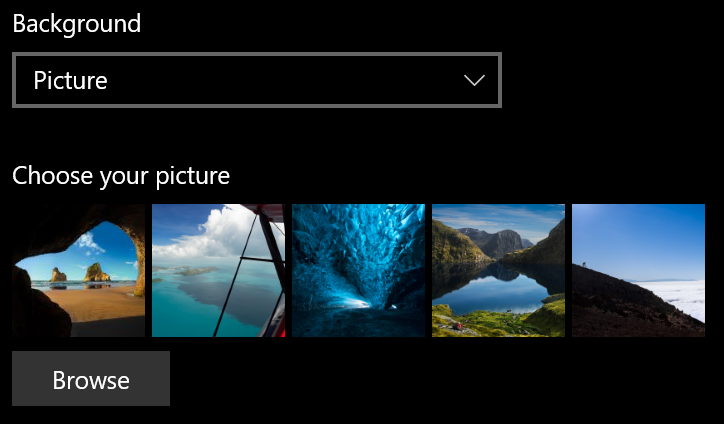
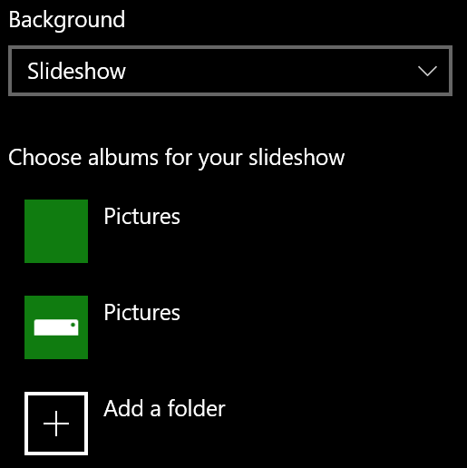

# Modificare lo sfondo della schermata di bloccoChange your lock screen background

- Vai a **Impostazioni**  >  **Schermata di blocco**  >  **personalizzazione**.Go to **Settings** > **Personalization** > **Lock screen**. In caso di clic o tocco [qui.](ms-settings:lockscreen?activationSource=GetHelp)Or click or tap [here](ms-settings:lockscreen?activationSource=GetHelp).

- Per impostare un'immagine di sfondo personalizzata, selezionare **Immagine** nell'elenco **a** discesa Sfondo e scegliere o **Sfoglia** per l'immagine.To set a custom background picture, select **Picture** from the **Background** drop-down list, and choose or **Browse** to the picture.

  

- Per configurare una presentazione di immagini personalizzate, selezionare **Presentazione** nell'elenco a discesa Sfondo e scegliere un album o aggiungere una cartella contenente le immagini per la presentazione. To set up a slideshow of custom pictures, select **Slideshow** from the **Background** drop-down list, and choose an album or add a folder that contains the pictures for the slideshow.

  
