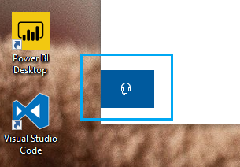

# Contattaci facendo clic sul pulsante cuffiaContact us by clicking the headphone button

Se si desidera contattare il supporto tecnico Microsoft, fare clic su **Contattaci** nell'angolo in basso a sinistra dell'app.If you'd like to contact Microsoft Support, please click **Contact us** in the lower left corner of this app. All'interno della finestra di fly-out, verrà guidato il canale di supporto destro dopo aver scelto la categoria del prodotto e del problema.Inside the fly-out window, you will be guided to the right support channel after choosing your product and issue category.

È possibile continuare a interagire con il resto dell'app anche dopo aver avviato una sessione contattaci.You can keep interacting with the rest of the app even after you have initiated a Contact us session. Il pannello Contattaci può essere ridotto a icona temporaneamente facendo clic in qualsiasi altro posto all'interno dell'app.The Contact us panel can be temporarily minimized by clicking anywhere else inside the app. Per tornare alla stessa sessione, basta fare clic su **Contattaci** .To return to the same session, just click **Contact us** again.
