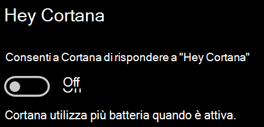

# Cortana non parla o non senteCortana doesn’t talk to me or can’t hear me

Se si prova a usare la funzionalità "Ehi Cortana", che consente di parlare con Cortana senza selezionare il pulsante Cortana nella barra delle applicazioni o il pulsante Microfono nel pannello Cortana, verificare che la funzionalità sia abilitata:If you are trying to use the "Hey Cortana" feature, which allows you to talk to Cortana without selecting the Cortana button on the taskbar or the microphone button in the Cortana panel, confirm that the feature is enabled:

1. Passare a **Start**, quindi selezionare **[Impostazioni > Cortana](ms-settings:cortana?activationSource=GetHelp)**.Go to **Start**, then select **[Settings > Cortana](ms-settings:cortana?activationSource=GetHelp)**.
2. In **Ehi Cortana** impostare l'interruttore **Permetti a Cortana di rispondere a "Ehi Cortana"** su **Attivato**.Under **Hey Cortana**, switch the **Let Cortana respond to "Hey Cortana"** toggle to **On**.

**Le impostazioni di privacy personali impediscono a Cortana di sentire?****Are your privacy settings preventing Cortana from hearing you?**

Le impostazioni di privacy personali possono impedire a Cortana di rispondere alle domande.Your privacy settings can prevent Cortana from responding to your voice.
- Verificare che il riconoscimento vocale online sia attivato:Check to make sure Online Speech recognition is turned on:
    - Passare a **Start**, quindi fare clic su **[Impostazioni > Privacy > Riconoscimento vocale](ms-settings:privacy-speech?activationSource=GetHelp)**.Go to **Start**, then click **[Settings > Privacy > Speech](ms-settings:privacy-speech?activationSource=GetHelp)**.
    - In **Riconoscimento vocale online** cambiare l'impostazione in **Attivato**.Under **Online speech recognition**, switch the setting to **On**.
- Verificare che Cortana disponga dell'autorizzazione per accedere al microfono.Check to make sure Cortana has permission to access your microphone. 
    - Passare a Start, quindi fare clic su **[Impostazioni > Privacy > Microfono](ms-settings:privacy-microphone?activationSource=GetHelp)**.Go to Start, then click **[Settings > Privacy > Microphone](ms-settings:privacy-microphone?activationSource=GetHelp)**.
    - In **Scegli le app che possono accedere al microfono** cercare **Cortana** nell'elenco delle app e dei servizi e assicurarsi che l'interruttore sia impostato su **Attivato**.Under **Choose which apps can access your microphone**, look for **Cortana** within the list of apps and services and make sure the switch is toggled to **On**.

Assicurarsi inoltre che gli altoparlanti o i microfoni funzionino per parlare con Cortana.Moreover, please also make sure that your speakers or microphones are up and working in order to talk to Cortana.
