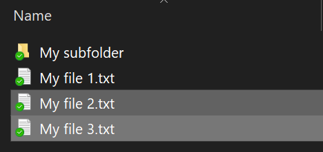
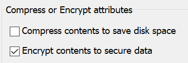

# Crittografare i file o le cartelle in Windows 10

Tramite BitLocker è possibile crittografare un intero disco, ma per crittografare solo singoli file o cartelle e il relativo contenuto, agire secondo la procedura seguente:

1. In **Esplora file** selezionare i file o le cartelle che si vogliono crittografare. In questo esempio sono stati selezionati due file:

    

2. Fare clic con il pulsante destro del mouse sui file selezionati e scegliere **Proprietà**.

3. Nella finestra delle **Proprietà**, fare clic su **Avanzate**.

4. Nella finestra **Proprietà avanzate** selezionare la casella di controllo **Crittografa contenuto per proteggere i dati**:

    

5. Fare clic su **OK**.
