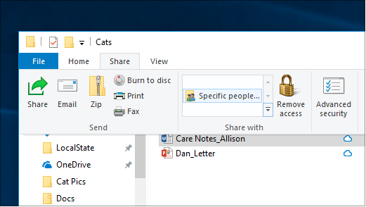
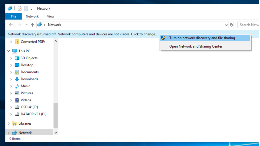

# Condivisione di file su una rete in Windows 10File sharing over a network in Windows 10

**Nota**: se in precedenza è stato utilizzato Gruppo Home per la condivisione dei file, tenere presente che il gruppo Home è stato rimosso da Windows 10 (versione 1803).**Note**: If you previously used HomeGroup for file sharing, please note that HomeGroup has been removed from Windows 10 (Version 1803). È ora possibile condividere stampanti e file utilizzando funzionalità predefinite in Windows 10.You can now share printers and files by using built-in features in Windows 10.

**Per condividere file o cartelle in una rete****To share files or folders over a network**

- In **Esplora file**selezionare un file > fare clic sulla scheda **Condividi** nella parte superiore > nella sezione **Condividi con** fare clic su **persone specifiche**.In **File Explorer**, select a file > click the **Share** tab at the top > in the **Share with** section, click **Specific people**.

    
          
- Se si selezionano più file contemporaneamente, è possibile condividerli tutti nello stesso modo.If you select multiple files at once, you can share them all in the same way. Funziona anche per le cartelle.It works for folders, too.

**Per visualizzare i dispositivi nella rete che condividono i file****To see devices on the network that are sharing files**

- In **Esplora file**passare a **rete**.In **File Explorer**, go to **Network**. Se l'individuazione della rete non è abilitata, verrà visualizzato un messaggio di errore che indica che l'individuazione della rete è disattivata...If Network discovery is not enabled, you will see an error message "Network discovery is turned off..."

- Fare clic sull' **individuazione della rete è disattivato** banner, quindi fare clic **su Attiva individuazione rete e condivisione file**.Click the **Network discovery is turned off** banner, then click **Turn on network discovery and file sharing**.

    

[Ulteriori informazioni sulla condivisione di file su una reteRead more about file sharing over a network](https://support.microsoft.com/help/4092694/windows-10-file-sharing-over-a-network)

[Condividere file con app, OneDrive, messaggi di posta elettronica e altro ancoraShare files using apps, OneDrive, emails, and more](https://support.microsoft.com/help/4027674/windows-10-share-files-in-file-explorer)
