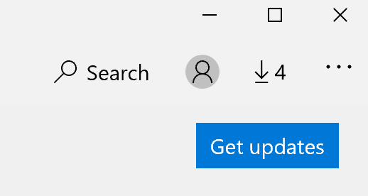

# Correggere la lingua di visualizzazione delle appFix the display language of apps

Dopo aver modificato la lingua di visualizzazione in Windows 10, alcune app potrebbero comunque usare la lingua precedente quando le apri.After you change the display language in Windows 10, some apps may still use the previous language when you open them. Ciò accade perché le nuove versioni delle app per tale lingua devono essere scaricate dallo Store.This happens because new versions of the apps for that language must be downloaded from the Store. Per risolvere il problema, puoi attendere l'aggiornamento automatico oppure installare manualmente la versione aggiornata delle app.To fix this problem, you can either wait for the automatic update, or you can manually install the updated version of the apps.

Per installare manualmente l'aggiornamento, apri **Microsoft Store** e fai clic su **Download e aggiornamenti** nell'angolo in alto a destra.To manually install the update, open **Microsoft Store** and click **Downloads and updates** in the top right corner. Fare quindi clic **su Ottieni aggiornamenti**.Then click **Get updates**. Se la lingua non viene modificata al termine dell'aggiornamento, prova a riavviare il PC.If the language is not changed after the update is complete, try restarting your PC.

Per altre informazioni sulle impostazioni della lingua di input e visualizzazione, vedi Gestire le impostazioni della lingua di input e [di visualizzazione in Windows 10.](https://support.microsoft.com/help/4027670/windows-10-add-and-switch-input-and-display-language-preferences)To read more about input and display language settings, see [Manage your input and display language settings in Windows 10](https://support.microsoft.com/help/4027670/windows-10-add-and-switch-input-and-display-language-preferences).
