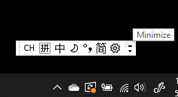
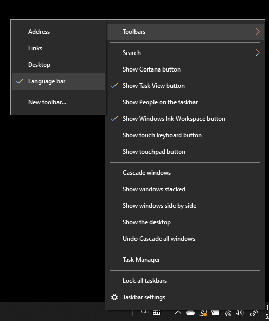
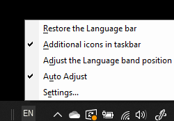

# Nascondere, visualizzare o reimpostare la barra della lingua

**Per ridurre a icona la barra della lingua:**

È possibile fare clic sul pulsante Riduci a icona nell'angolo in alto a destra della barra della lingua. In alternativa, è possibile trascinare la barra della lingua sulla barra delle applicazioni per ridurla automaticamente.

**Per disancorare la barra della lingua:**

Se non si vuole ancorare la barra della lingua alla barra delle applicazioni, fare clic con il pulsante destro del mouse su uno spazio vuoto nella barra delle applicazioni, quindi deselezionare l'opzione **Barra della lingua** nel menu Barre degli strumenti. La barra della lingua verrà visualizzata all'esterno della barra delle applicazioni, proprio come nella schermata precedente.

**Per ripristinare l'impostazione predefinita della barra della lingua:**

Fare clic con il pulsante destro del mouse sul pulsante della lingua sulla barra degli strumenti e quindi fare clic sull'opzione **Ripristina barra della lingua** nel menu. Verrà ripristinata l'impostazione predefinita.

