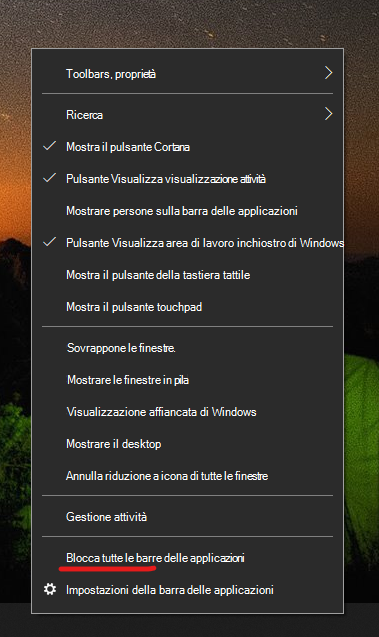

# Spostare la barra delle applicazioni su uno dei lati o nella parte superiore del desktop

Innanzitutto, verificare che la barra delle applicazioni sia sbloccata. Per scoprire se è sbloccata, fare clic con il pulsante destro del mouse su uno spazio vuoto sulla barra delle applicazioni e controllare se accanto a **Blocca la barra delle applicazioni** c’è un segno di spunta. Se è presente un segno di spunta, la barra delle applicazioni è bloccata e non può essere spostata. Se si clic una volta su **Blocca la barra delle applicazioni** si sblocca e il segno di spunta viene rimosso.

Se sono presenti più monitor che visualizzano la barra delle applicazioni, verrà visualizzato **Blocca tutte le barre delle applicazioni**.

Dopo aver sbloccato la barra delle applicazioni, è possibile premere su uno spazio vuoto della barra delle applicazioni e, tenendo premuto, trascinarla nella posizione desiderata sullo schermo. È anche possibile fare clic con il pulsante destro del mouse su uno spazio vuoto sulla barra delle applicazioni e passare a **[Impostazioni della barra delle applicazioni](ms-settings:taskbar?activationSource=GetHelp) > Posizione della barra delle applicazioni sullo schermo**.
