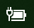
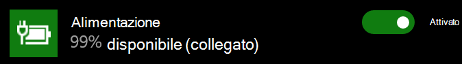

# Icona della batteria o dell'alimentazione non presente in Windows 10

Se il dispositivo Windows 10 è dotato di una batteria (ad es. portatile o tablet o PC connesso a un USP tramite USB), in genere l'icona della batteria/alimentazione è visibile nella barra delle applicazioni accanto all'orologio, ad esempio:

Se tale icona non è visibile, è possibile che sia nascosta:

1. Passare a **[Impostazioni > Personalizzazione > Barra delle applicazioni](ms-settings:taskbar?activationSource=GetHelp)**.

2. Nell'area Notifica fare clic su **Seleziona le icone da visualizzare sulla barra delle applicazioni**.

3. Trovare quindi l'elemento **Alimentazione** nell'elenco e spostare l'impostazione su **Attivato**.

    

**Risoluzione dei problemi**

Se sono state seguite le istruzioni riportate sopra e l'interruttore **Alimentazione** è disattivato o non è visibile, nella casella di ricerca della barra delle applicazioni digitare **gestione dispositivi**, quindi selezionare **Gestione dispositivi** nell'elenco dei risultati. In **Batterie** fare clic con il pulsante destro sulla batteria del dispositivo, fare clic su **Disabilita**, quindi su **Sì**. Attendere qualche secondo, quindi fare clic con il pulsante destro sulla batteria e fare clic su **Abilita**. Riavviare il dispositivo.

Se sono state seguite le istruzioni riportate sopra, ma l'icona della batteria non viene visualizzata nella barra delle applicazioni, nella casella di ricerca della barra delle applicazioni digitare **gestione attività**, quindi fare clic su **Gestione attività** nell'elenco dei risultati. Nella scheda **Processi** sotto **Nome** fare clic con il pulsante destro su **Explorer**, quindi fare clic su **Riavvia**.
