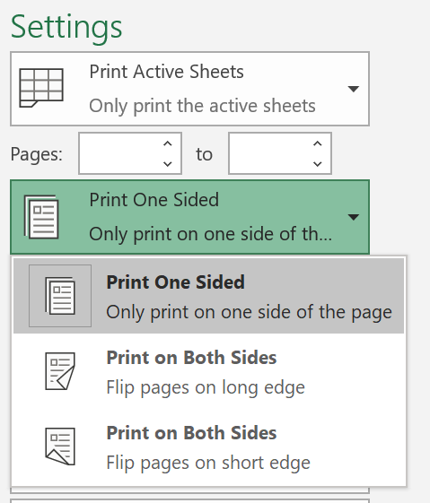
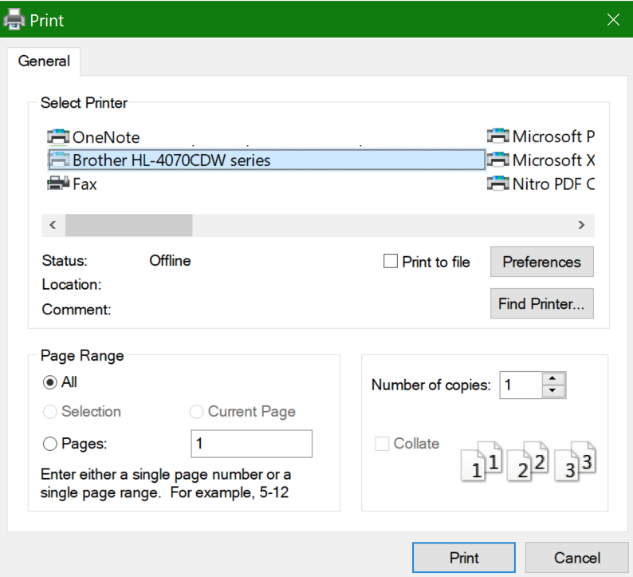

# Stampa su entrambi i lati del foglio (fronte retro)Printing on both sides of paper (duplex printing)

**La mia stampante supporta la stampa fronte retro?****Is my printer capable of duplex printing?**

Il manuale o il riepilogo delle caratteristiche della stampante dovrebbe indicare se supporta la stampa su entrambi i lati del foglio, anche detta "stampa fronte retro".Your printer’s feature summary or manual should tell you whether it is capable of printing on both sides of the paper, also known as “duplex printing.” Se si ha Microsoft Office, un altro modo per scoprirlo è aprire un'app di Office come Word o Excel, passare a **File > Stampa**, accertarsi che sia selezionata la stampante corretta e cercare la funzionalità nella sezione Impostazioni.If you have Microsoft Office, another way to find out is by opening an Office app like Word or Excel, going to **File > Print**, making sure the right printer is selected, and looking for the capability in the Settings section. Ad esempio:For example: 

**Stampa fronte retro in Microsoft Office****Duplex printing in Microsoft Office**

Se la stampante è in grado di stampare su entrambi i lati, quando si passa a **File > Stampa** nell'app di Office sarà presente l'opzione "Stampa su entrambi i lati", come mostrato nell'esempio precedente.If your printer is capable of printing on both sides, when you go to **File > Print** in the Office app, you will see an option to “Print on Both Sides,” as shown in the example above.  Selezionare il tipo di stampa fronte retro desiderata (capovolgere le pagine sul lato lungo o sul lato corto) e quindi fare clic su **Stampa** per avviare il processo.Select the type of duplex printing you want (flip on long edge, or flip on short edge), and click **Print** to start the printout.

**Stampa fronte retro da qualsiasi applicazione****Duplex printing from any application**

In molte app, quando si stampa verrà visualizzata una finestra di dialogo di stampa generale simile alla seguente:In many apps when you print you will see a general print dialog that looks like this: 

Verificare che sia selezionata la stampante giusta, quindi fare clic su **Preferenze** per aprire la finestra di dialogo delle preferenze della stampante.Make sure the right printer is selected, then click **Preferences** to open the printer preferences window. Se la stampante supporta la stampa fronte retro, nella finestra sarà presente l'opzione per abilitarla per il processo di stampa corrente.If the printer is capable of duplex printing, the ability to enable this for the current print job will show in that window.
