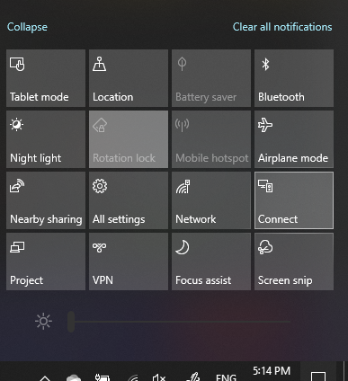

# Proiettare in un PCProject to a PC

Nel dispositivo di destinazione, a cui si sta proiettando, cercare "Impostazioni di proiezione" per aprire la pagina delle impostazioni di **Proiezione in questo PC**.On your destination device (projecting to), search for "Projection Settings" to open the Settings page of **Projecting to this PC**. Assicurarsi che:Then make sure that:
- il menu a discesa con "Alcuni dispositivi Windows e Android possono proiettare su questo PC quando dici che è OK" è impostato su **Sempre disattivato**."Some Windows and Android devices can project to this PC when you say it's OK" drop-down menu is set to **Always Off**.
- Il menu a discesa "Chiedi di proiettare in questo PC" è impostato su **Ogni volta che è necessaria una connessione**."Ask to project to this PC" drop-down menu is set to **Every time a connection is required**.
- Il menu a discesa "Richiedi PIN per l'associazione" è impostato su **Mai**."Require PIN for pairing" drop-down menu is set to **Never**.

Nel dispositivo di destinazione avviare **Connetti** l’app passando a **Avvia** e cercare "Connetti".On your destination device, launch **Connect** app by going to **Start** and search for "Connect".

Quindi, nel dispositivo di origine dal quale si sta provando a proiettare:Then, on your source device that you are trying to project from:

1. Premere Il**tasto WINDOWS + A** per aprire Centro operativo.Press **Windows key + A** to open Action Center.
2. Fare clic su **Connetti**.Click **Connect**.
3. Fare clic sul dispositivo in cui si vuole proiettare lo schermo.Click the device you want to project the screen to.

Dopo la procedura descritta sopra, il dispositivo di destinazione deve visualizzare la schermata del dispositivo di origine come se si trattasse di un monitor secondario.After the above steps, your destination device should display the screen of the source device as if it is a secondary monitor.
