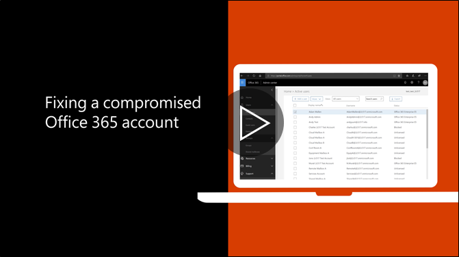

# Procedure consigliate da eseguire se un account viene compromesso

  
1. Immediatamente [reimpostare la password dell'utente](https://support.office.com/article/7a5d073b-7fae-4aa5-8f96-9ecd041aba9c) . Non comunicare la nuova password tramite posta elettronica per l'utente finale. 
    
2. Rimuovere qualsiasi sospetti [inoltro indirizzi](https://support.office.com/article/ab5eb117-0f22-4fa7-a662-3a6bdb0add74) impostato a livello di cassetta postale. 
    
3. Rimuove le sospetti [regole posta in arrivo](https://support.office.com/article/1433E3A0-7FB0-4999-B536-50E05CB67FED) all'interno della cassetta postale. 
    
4. Se l'utente è bloccato l'invio di posta elettronica, [andare a utenti con restrizioni per sbloccare l'account](https://protection.office.com/?hash=/restrictedusers). Al termine, l'utente deve essere in grado di riprendere l'invio di messaggi all'interno di un'ora.
    
5. Rimuovere l'account utente da tutti i [gruppi di ruoli amministrativi](https://support.office.com/article/eac4d046-1afd-4f1a-85fc-8219c79e1504) fino a quando non si è certi che l'account non è più viene compromesso. 
    
Per ridurre al minimo la possibilità di una violazione dei dati o un account compromesso in futuro, è consigliabile leggere questo [articolo consigliate procedure di sicurezza di Office 365](https://support.office.com/article/9295e396-e53d-49b9-ae9b-0b5828cdedc3).
  

