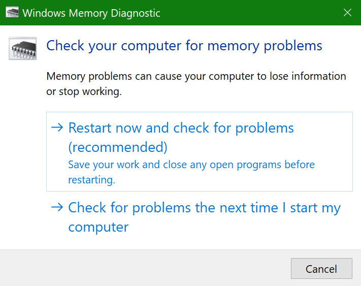
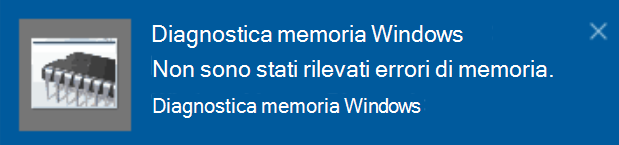

# Eseguire diagnostica memoria Windows in Windows 10

Se Windows e le app nel PC si arrestano all'improvviso, si bloccano o si comportano in modo instabile, potrebbe esserci un problema con la memoria del PC. È possibile eseguire diagnostica memoria Windows per verificare se sono presenti problemi con la RAM del PC.

Nella casella di ricerca della barra delle applicazioni digitare **diagnostica memoria**, quindi selezionare **Diagnostica memoria Windows**. 

Per eseguire la diagnostica, è necessario riavviare il PC. È possibile riavviarlo immediatamente (salvare il lavoro e chiudere i documenti aperti e i messaggi di posta elettronica prima) o pianificare la diagnostica da eseguire automaticamente al successivo riavvio del PC:

Quando il PC si riavvia, lo **Strumento di diagnostica memoria Windows** verrà eseguito automaticamente. Durante l'esecuzione della diagnostica verranno mostrato lo stato e l'avanzamento e sarà possibile annullare la diagnostica premendo il tasto **ESC** sulla tastiera.

Quando la diagnostica è completata, Windows si avvierà normalmente.
Subito dopo il riavvio, quando viene visualizzato il desktop, sarà visibile una notifica (accanto all'icona del **centro notifiche** nella barra delle applicazioni) che indica se sono stati trovati errori di memoria. Ad esempio:

Ecco l'icona del centro notifiche:  

Ecco una notifica esemplificativa: 

Se non è visibile alcuna notifica, è possibile selezionare l'icona del **centro notifiche** nella barra delle applicazioni per visualizzare il **centro notifiche** e vedere un elenco di notifiche scorrevole.

Per rivedere le informazioni dettagliate, digitare **evento** nella casella di ricerca della barra delle applicazioni, quindi selezionare **Visualizzatore eventi**. Nel riquadro sinistro di **Visualizzatore eventi** passare a **Log di Windows > Sistema**. Nel riquadro destro scorrere l'elenco verso il basso esaminando la colonna **Origine** finché non vengono visualizzati gli eventi con il valore di origine **MemoryDiagnostics-Results**. Evidenziare ogni evento di questo tipo e consultare le informazioni relative ai risultati nella casella nella scheda **Generale** sotto l'elenco.
