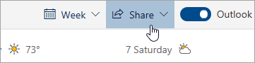

# Condivisione con Outlook sul Web

Dal calendario, nella parte superiore della pagina selezionare  **Condividi**, quindi scegliere il calendario da condividere.

    

**Nota**: non è possibile condividere i calendari di proprietà di altri utenti.

- Immettere l'indirizzo di posta elettronica o il nome della persona con cui si vuole condividere il calendario.
- Scegliere il modo in cui questa persona dovrà usare il calendario:
    - **Possono vedere quando sono occupato**  consente all'altra persona di vedere quando non si è disponibili, ma non include dettagli come il luogo dell'evento.
    - **Possono vedere titoli e luoghi**  consente alla persona di vedere quando non si è disponibili e anche di visualizzare il titolo e il luogo degli eventi.
    - **Possono vedere tutti i dettagli**  consente alla persona di vedere tutti i dettagli degli eventi.
    - **Può modificare** consente di modificare il calendario.
    - **Delegato**  consente alla persona di modificare il calendario e condividerlo con altri utenti.
- Selezionare **Condividi**.
