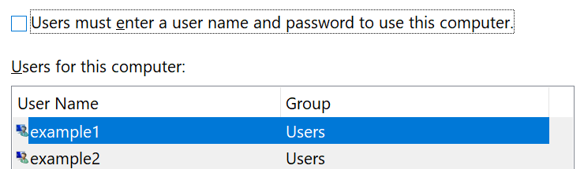

# Accedere a Windows 10 senza utilizzare una passwordSign-in to Windows 10 without using a password

Per evitare di dover digitare una password all'avvio di Windows, si consiglia di utilizzare una delle opzioni di accesso sicuro di Windows Hello, come un PIN, il riconoscimento del volto o l'impronta digitale, se disponibile.To avoid having to type a password at Windows startup, we recommend you use one of the Windows Hello secure sign-in options, like a PIN, face recognition, or fingerprint, if available. Se si vuole davvero disabilitare l'accesso sicuro, vedere le istruzioni "Accedi automaticamente a Windows 10" di seguito.If you really want to disable secure sign-in, see the "Automatically sign in to Windows 10" instructions below.

**Protezione delle alternative di Windows Hello per la password dell'account****Secure Windows Hello alternatives to the account password**

Andare a **impostazioni > account > opzioni di accesso** (o fare clic [qui](ms-settings:signinoptions?activationSource=GetHelp)).Go to **Settings  > Accounts > Sign-in options** (or click [here](ms-settings:signinoptions?activationSource=GetHelp)). Vengono elencate le opzioni di accesso disponibili.Available sign-in options will be listed. Ad esempio:For example:

Fare clic o toccare una delle opzioni per configurarla.Click or tap one of the options to configure it. La volta successiva che si avvia o si sblocca Windows, è possibile utilizzare la nuova opzione invece di una password.Next time you start or unlock Windows, you will be able to use the new option instead of a password. 

**Accesso automatico a Windows 10****Automatically sign-in to Windows 10**

**Nota**: l'accesso automatico è comodo, ma introduce un rischio per la sicurezza, soprattutto se il PC è accessibile da più persone.**Note**: Automatic sign-in is convenient, but introduces a security risk, especially if your PC is accessible by multiple people. 

1. Fare clic o toccare il pulsante **Start** nella barra delle applicazioni.Click or tap the **Start** button in the Taskbar.

2. Digitare **Netplwiz** e premere INVIO per aprire la finestra account utente.Type **netplwiz** and hit the Enter key to open the User Accounts window.

3. In **account utente**, fare clic sull'account che si desidera accedere automaticamente al momento dell'avvio di Windows.In **User Accounts**, click the account you want to automatically sign in to when Windows starts.

4. Deselezionare la casella di controllo "gli utenti devono immettere un nome utente e una password per l'utilizzo del computer".Uncheck the "Users must enter a user name and password to use this computer" checkbox.

    

5. Fare clic su **OK**.Click **OK**. Verrà chiesto di immettere e confermare la password per l'account selezionato.You will be asked to enter and confirm the password for the account you selected. Fare clic su **OK** per terminare.Click **OK** to finish. La volta successiva che viene avviato Windows 10, l'utente accede automaticamente all'account selezionato.Next time Windows 10 starts, it will automatically sign in to the account you selected.
