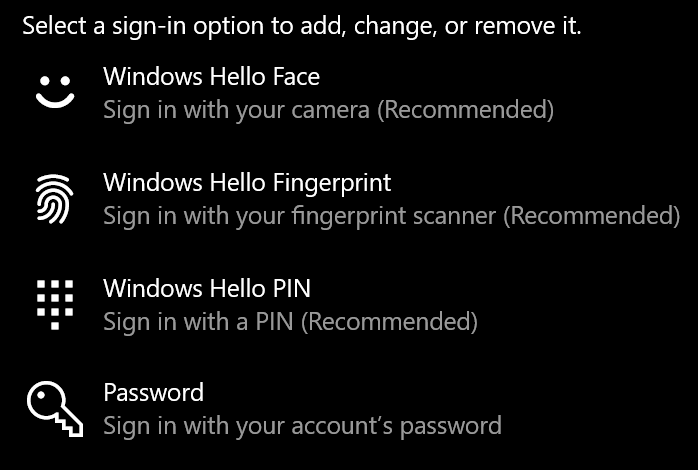
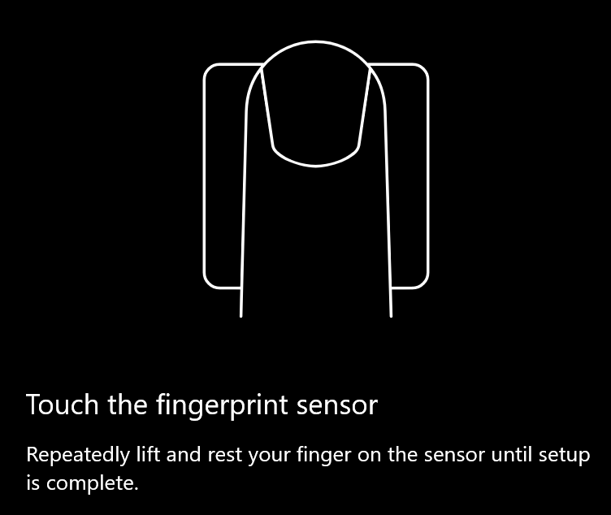
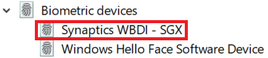

# Utilizzare l'opzione di sblocco dell'impronta digitale in Windows 10Use fingerprint unlock option in Windows 10

**Abilitazione di Windows Hello Fingerprint****Enable Windows Hello Fingerprint**

Per sbloccare Windows 10 con l'impronta digitale, è necessario configurare Windows Hello Fingerprint aggiungendo (lasciando Windows Learn to recognize) almeno un dito.To unlock Windows 10 using your fingerprint, you need to set up Windows Hello Fingerprint by adding (letting Windows learn to recognize) at least one finger. 

1. Andare a **impostazioni > account > opzioni di accesso** (o fare clic [qui](ms-settings:signinoptions?activationSource=GetHelp)).Go to **Settings  > Accounts > Sign-in options** (or click [here](ms-settings:signinoptions?activationSource=GetHelp)). Vengono elencate le opzioni di accesso disponibili.Available sign-in options will be listed. Ad esempio:For example:

    

2. Fare clic o toccare **Windows Hello Fingerprint**, quindi fare clic su **Configura**.Click or tap **Windows Hello Fingerprint**, then click **Set up**. Nella finestra del programma di installazione di Windows Hello fare clic su **inizia**.In the Windows Hello setup window, click **Get started**. Il sensore di impronte digitali si attiverà e ti verrà richiesto di posizionare il dito sul sensore:The fingerprint sensor will activate, and you'll be asked to place your finger on the sensor:

   

3. Segui le istruzioni, in cui viene chiesto di eseguire la scansione ripetuta del dito.Follow the instructions, which will ask you to repeatedly scan your finger. Al termine, si avrà la possibilità di aggiungere altre dita che si desidera utilizzare per l'accesso.When this is finished, you'll have the option of adding other fingers you may want to use for sign-in. La volta successiva che si accede a Windows 10, si avrà la possibilità di utilizzare l'impronta digitale per farlo.Next time you sign in to Windows 10, you will have the option of using your fingerprint to do so.

**Windows Hello Fingerprint non disponibile come opzione di accesso****Windows Hello Fingerprint not available as a sign-in option**

Se Windows Hello Fingerprint non è visualizzato come opzione nelle **Opzioni di accesso**, significa che Windows non è a conoscenza di un lettore/scanner di impronte digitali collegato al PC o che un criterio di sistema ne impedisce l'utilizzo (se ad esempio il PC è gestito dal proprio ambiente di lavoro).If Windows Hello Fingerprint is not shown as an option in **Sign-in options**, it means Windows is not aware of any fingerprint reader/scanner attached to your PC, or that a system policy prevents its use (if for example your PC is managed by your workplace). Per risolvere i problemi:To troubleshoot: 

1. Selezionare il pulsante **Start** nella barra delle applicazioni e cercare **Gestione dispositivi**.Select the **Start** button in the Taskbar and search for **Device Manager**.

2. Fare clic o toccare per aprire **Gestione dispositivi**.Click or tap to open **Device Manager**.

3. In gestione dispositivi espandere i dispositivi biometrici facendo clic sul relativo Chevron.In Device Manager, expand Biometric devices by clicking its chevron.

   

4. Lo scanner di impronte digitali dovrebbe essere elencato come dispositivo biometrico, ad esempio lo scanner Synaptics WBDI:Your fingerprint scanner should be listed as a biometric device, such as the Synaptics WBDI scanner:

   

5. Se lo scanner di impronte digitali non è visualizzato e lo scanner è integrato nel PC, passare al sito Web del produttore del PC.If your fingerprint scanner is not shown, and the scanner is integrated into your PC, go to the PC manufacturer's website. Nella sezione supporto tecnico per il modello di PC, cercare un driver di Windows 10 per uno scanner che è possibile installare.In the technical support section for your PC model, search for a Windows 10 driver for a scanner that you can install.

6. Se lo scanner è separato dal PC (collegato tramite USB), passare al sito Web del produttore dello scanner per individuare e installare il software del driver di dispositivo di Windows 10 per il modello dello scanner di cui si dispone.If the scanner is separate from the PC (attached via USB), go to the scanner manufacturer's website to find and install Windows 10 device driver software for the scanner model you have.
