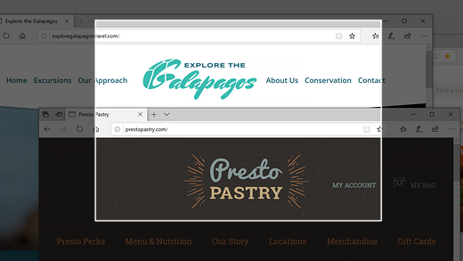
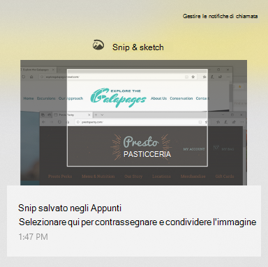

# Usare Snip & Sketch per acquisire, contrassegnare e condividere immagini

Lo schizzo dello schermo è **ora denominato Snip & Sketch**. **Per eseguire rapidamente un'enip:**

1. Premere il **tasto WINDOWS + MAIUSC + S**. Vedrai lo schermo scuro e il cursore visualizzato come una croce. 

2. Scegliere un punto sul bordo dell'area che si desidera copiare e fare clic con il pulsante sinistro del mouse sul cursore. 

3. Spostare il cursore per evidenziare l'area che si desidera acquisire. L'area che acquisisci verrà visualizzata sullo schermo.

   

L'immagine copiata viene salvata negli Appunti, pronta per essere incollata in un messaggio di posta elettronica o in un documento. 

**Se si desidera modificare o visualizzare l'immagine:** 

- Fai clic sull'icona delle notifiche all'estrema destra della barra delle applicazioni; quindi fare clic sull'immagine appena acquisita. Il tuo snip viene aperto nell'app Snip & Sketch.

   
