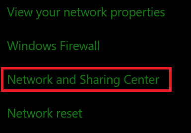
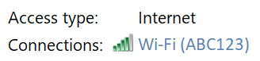
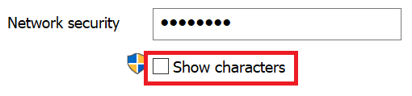

# Visualizzare la password di rete Wi-Fi in Windows 10View Wi-Fi network password in Windows 10

1. Verificare che il PC Windows 10 sia connesso alla rete Wi-Fi.Make sure your Windows 10 PC is connected to the Wi-Fi network.

2. Andare a **Settings > Network & Internet > status**oppure fare clic o toccare [qui](ms-settings:network?activationSource=GetHelp) per farci prendere subito.)Go to **Settings  > Network & Internet  > Status**, or click or tap [here](ms-settings:network?activationSource=GetHelp) to let us take you there now.)

3. Fare clic su **Centro connessioni di rete e condivisione**.Click **Network and Sharing Center**.

    

4. In **Centro rete e condivisione**, accanto a **connessioni**, verrà visualizzato il nome della rete wireless.In **Network and Sharing Center**, next to **Connections**, you will see the name of your wireless network. Ad esempio, se la rete è denominata "ABC123", è possibile che venga visualizzato quanto segue:For example, if your network is named "ABC123," you might see:

    

    Fare clic sul nome della rete wireless per aprire la finestra di stato Wi-Fi.Click the wireless network name to open the Wi-Fi Status window. 

5. Nella finestra stato Wi-Fi, fare clic su **Proprietà wireless**, fare clic sulla scheda **sicurezza** e selezionare **Mostra caratteri**.In the Wi-Fi Status window, click **Wireless Properties**, click the **Security** tab, and check **Show characters**.

    

